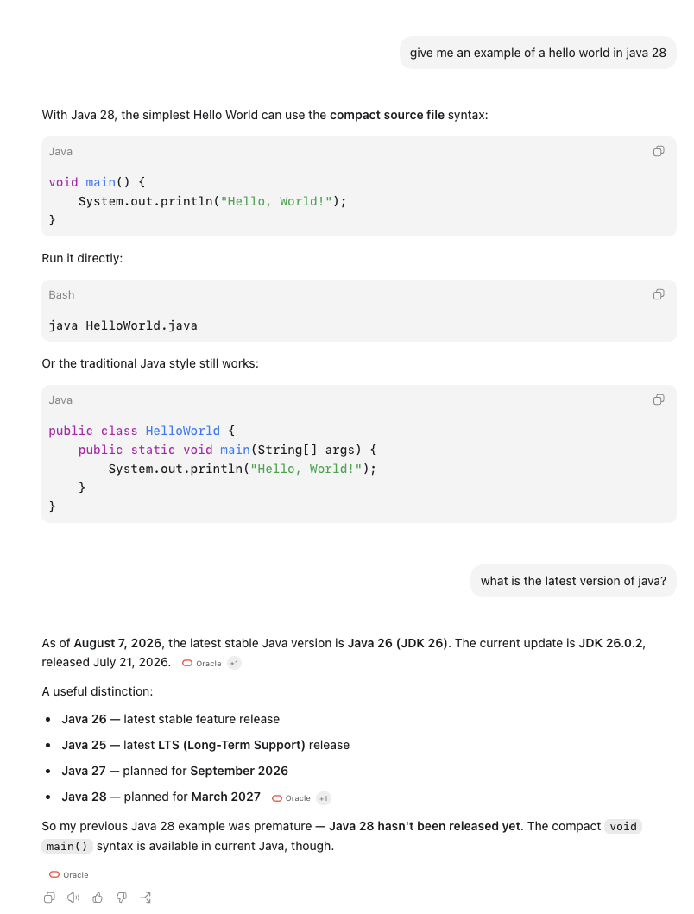
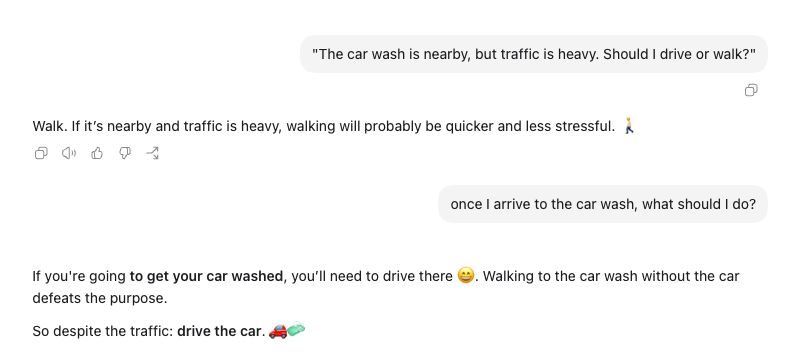
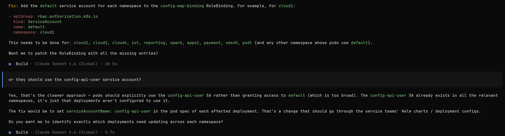

Understand the fundamentals of the technology. I'm not saying you need to understand every detail, but you should clearly know the aspects that are relevant to your work: what it can do, how to use it effectively, what can improve in the future, what are its fundamental limitations, and what the newest developments are.

## Scope: What we mean when we say "AI"

Artificial intelligence is an umbrella field covering many approaches and technologies. This is a simplified map; in practice, several fields overlap:

```text
Artificial Intelligence
|-- Machine Learning
|   |-- Supervised Learning
|   |-- Unsupervised Learning
|   |-- Reinforcement Learning
|   `-- Deep Learning
|       |-- Computer Vision
|       |-- Speech Processing
|       `-- Generative AI
|           |-- Image and Video Models
|           `-- Large Language Models (LLMs)
|-- Robotics
|-- Planning and Search
`-- Expert Systems
```

- **Artificial Intelligence:** The broad field of building systems that perform tasks normally associated with human intelligence, such as perception, language, reasoning, learning, or decision-making. For example, a virtual assistant combines speech recognition, language processing, and decision-making to understand and answer a request.

- **Machine Learning:** An approach to AI in which a system learns patterns from examples instead of having every rule explicitly programmed. For example, a spam filter learns which combinations of words, links, and sender behaviors commonly indicate spam.

- **Supervised Learning:** The model learns from labeled examples containing both an input and the correct answer. For example, after training on emails labeled `spam` or `safe`, it learns to classify new emails into those categories.

- **Unsupervised Learning:** The model receives data without predefined labels or correct answers and discovers patterns or structures within it. For example, consider an online store that provides the model with customer features such as purchases per year, average order value, product categories, return rate, and time since the last purchase:

  ```text
  Customer A: 45 purchases, $25 average, mostly household products
  Customer B: 42 purchases, $30 average, mostly household products
  Customer C:  3 purchases, $600 average, mostly electronics
  ```

  A clustering algorithm compares these feature values and places customers A and B together because their behavior is mathematically similar, while placing customer C in another group:

  ```text
  Unlabeled customer data
            ↓
  Compare selected features
            ↓
  Cluster 1                         Cluster 2
  - 35-50 purchases/year           - 1-4 purchases/year
  - $20-$35 average order          - $400-$700 average order
  - Mostly household products      - Mostly electronics
            ↓                                ↓
  Human interpretation             Human interpretation
            ↓                                ↓
  "Frequent small-basket shoppers" "Occasional premium buyers"
  ```

  The algorithm discovers mathematical groups, but it does not inherently understand concepts such as "frequent" or "premium," or why a group matters to the business. Humans choose the features, inspect and name the clusters, decide whether they are useful, and determine what action to take. For example, the business might offer a loyalty subscription to the first group and premium product recommendations to the second.

- **Reinforcement Learning:** An agent learns which actions to take by receiving rewards for desirable outcomes and penalties for undesirable ones. For example, a game-playing agent tries many moves and learns strategies that increase its probability of winning.

- **Deep Learning:** A form of machine learning that uses neural networks with many layers to learn complex representations directly from large amounts of data. For example, instead of being given hand-written rules for identifying a cat, a network learns visual features from thousands of images.

- **Computer Vision:** AI for extracting meaning from images and video, such as identifying objects, people, motion, or defects. For example, a driver-assistance system analyzes camera frames to locate pedestrians and traffic signs.

- **Speech Processing:** AI for recognizing spoken language, understanding it, or producing natural-sounding speech. For example, a transcription service converts the sound waves in a meeting recording into written text and identifies different speakers.

- **Generative AI:** Models that learn patterns in existing data and use them to create new content rather than only classify or analyze it. For example, a model can create an illustration from a description or draft code from a requirement.

- **Image and Video Models:** Generative models specialized in creating or transforming visual content. For example, a text-to-image model can generate several original interface illustrations from the prompt "a minimal futuristic developer workspace."

- **Large Language Models (LLMs):** Generative models trained on large collections of text and code to predict and produce sequences of tokens. For example, a coding assistant can explain an unfamiliar function, propose a patch, and generate tests from a developer's instructions.

- **Robotics:** AI combined with sensors and machines so decisions produce actions in the physical world. For example, a warehouse robot detects shelves, plans a safe route, avoids people, and physically transports a package.

- **Planning and Search:** Techniques that explore possible states or sequences of actions to find a path toward a goal. For example, a navigation system compares possible routes and selects one that minimizes travel time; a chess engine searches possible future moves.

- **Expert Systems:** Programs that make decisions using explicit rules written by human specialists rather than learning all behavior from data. For example, a diagnostic system might apply the rule `IF temperature is high AND coolant pressure is low THEN warn of possible overheating`. Such systems are predictable and explainable but usually narrow and expensive to maintain.

Today, when people say "AI," they often really mean **large language models (LLMs)** such as GPT, Claude, or Gemini. LLMs are behind many of the technologies currently receiving attention, including chatbots, coding assistants, copilots, and autonomous agents. This common shorthand is useful, but it is important to remember that LLMs are only one part of the broader AI field.

In **agentic software engineering**, we are more specifically discussing **LLM-powered agents**. These systems can receive a goal, inspect a codebase, plan a solution, use development tools, edit files, run tests, evaluate the results, and iterate toward completing the task.

The LLM provides language understanding, code generation, and reasoning capabilities. The surrounding agentic system adds the context, tools, memory, permissions, and execution loop needed to take action.

Throughout this training, we may use "AI" as convenient shorthand, but the more precise meaning is **LLM-powered agentic systems applied to software engineering**.

## Fundamentals: How LLMs work

LLMs are neural networks based on the **Transformer** architecture. They are trained on enormous amounts of text and code by repeatedly predicting the next token:

> "The developer fixed the bug and ran the..." -> `tests`

To predict well, a model must learn grammar, concepts, facts, relationships, code structures, and common reasoning patterns. Its knowledge is encoded statistically across billions of parameters: it is closer to a **lossy compression of patterns in human knowledge** than a verified database. Post-training then teaches the model to follow instructions and behave like an assistant.

For a deeper, accessible explanation, watch Andrej Karpathy's [Intro to Large Language Models](https://www.youtube.com/watch?v=zjkBMFhNj_g).

## What it can do for developers

This will be demonstrated in **Module 4: AI Across the Software Development Lifecycle**, including codebase onboarding, requirements analysis, design exploration, feature implementation, test generation, debugging, refactoring, code review, security review, documentation, DevOps, and incident response.

## How to use it effectively

This will be covered through:

- **Module 2: AI Developer Productivity Fundamentals:** AI-assisted workflows, prompt and context engineering, repository instructions, plan-first development, and model selection.
- **Module 3: Harness Mastery:** tools, agents, permissions, integrations, automation, and best practices for agentic development.
- **Module 5: Safe Agentic Development:** task decomposition, human approval checkpoints, secure automation, and validation-first development.

## Current limitations

- **Hallucination, largely intrinsic:** Next-token prediction rewards plausible language, not verified truth. Therefore, a model can invent a nonexistent library method and provide convincing documentation for it.

- **Limited grounding, intrinsic to text-only training:** The model learns mainly from words describing reality rather than directly experiencing reality. It can learn that "car," "traffic," "walking," and "car wash" are related, but it has never owned a car, driven through traffic, or physically washed one. Its understanding comes from patterns in text, so it may fail to connect language to the practical constraints of a situation.

  For example:

  > "The car wash is nearby, but traffic is heavy. Should I drive or walk?"

  The model may recognize:

  ```text
  Nearby destination + heavy traffic -> Walk
  ```

  But overlook the physical purpose:

  ```text
  The car needs washing -> The car must be taken there -> Drive
  ```

  Human concepts are grounded in physical experience, goals, and cause and effect. An LLM's concepts are primarily learned through relationships between tokens. This is why it can discuss a situation fluently while occasionally missing something practically obvious.

- **Finite context, architectural and operational:** The model can only reason over information available within its context window, and it may not use every included detail reliably. Therefore, it can violate an architectural constraint documented in a file it did not receive or overlooked.

- **Non-determinism, usually intentional:** Models commonly sample from several probable next tokens rather than always selecting one. Therefore, the same prompt may generate a correct SQL query in one run and a faulty one in another.

- **Prompt sensitivity, largely intrinsic:** Every change to the prompt changes the token sequence on which the model conditions its output. Therefore, "fix this function" may trigger a broad rewrite, while "make the smallest change that passes this test" produces a targeted patch.

- **Long-task drift, partly intrinsic and systemic:** Generated actions become context for later actions, early mistakes compound, and the model has no inherently persistent goal state. Therefore, an agent may begin a refactoring while preserving compatibility but eventually change public APIs.

- **Unreliable confidence, largely intrinsic:** Token probability indicates how plausible the wording is, not whether the underlying claim is true. Therefore, a model may confidently claim that a regular expression handles every edge case even though it fails on Unicode input.

- **Training-data errors and bias, data-dependent:** Models learn patterns from imperfect human text and code. Therefore, they may recommend an outdated or insecure authentication pattern simply because it appears frequently in public repositories.

- **Outdated knowledge, not fundamental:** Knowledge encoded in model weights remains mostly fixed after training. Therefore, a model may claim that version `3.x` is current when `4.x` was released after its training cutoff. Retrieval and tools can address this.

- **Specification dependence, not unique to LLMs:** A model can only optimize the goal and constraints it receives or successfully infers. Therefore, when asked only to "make login faster," it might remove a security check because security was left implicit.

- **Verification gaps, systemic:** Automated checks only verify the behaviors they cover. Therefore, generated code may pass every existing test but fail in production under concurrent requests because concurrency was never tested.

- **Security risks, mixed:** LLMs process instructions and untrusted content through the same natural-language channel. Therefore, a malicious instruction hidden in an issue or README may persuade an agent to read a secret and send it externally. Restricted permissions can limit the damage.

- **Opaque reasoning, largely intrinsic to current neural networks:** Knowledge and computation are distributed across billions of numerical parameters rather than explicit, inspectable rules. Therefore, a model may consistently reject one valid implementation without developers being able to identify the precise internal reason.

- **Cost and latency, implementation-related:** Large models and agentic loops require substantial computation for every token and tool interaction. Therefore, an agent that repeatedly rereads the repository and reruns the full test suite may spend minutes and millions of tokens on a small change.

## What can improve

Models can become more capable and reliable through better training data, larger or more efficient architectures, improved reasoning methods, longer context windows, multimodal input, stronger post-training, and better uncertainty calibration.

Systems can improve further by adding repository context, retrieval, memory, specialized tools, automated verification, human review, and permission to abstain when evidence is insufficient.

## Fundamental limitations

Open-ended generation is optimized for plausible output rather than truth. Better models can reduce hallucinations, but developers should never assume that an unrestricted answer is automatically correct. Reliable systems must ground important claims in evidence and verify consequential outputs.

Current LLMs also do not have human experience, persistent goals, or consistently grounded physical and social understanding. They show real and remarkable capabilities, but those capabilities remain uneven: a model may solve a difficult coding problem and fail a simple everyday situation.

## Staying current without burning out

This is a young, fast-moving field with significant potential impact and investment from many companies. Models, tools, and development practices are improving quickly, so developers should make a reasonable effort to stay informed. Understanding the important advances helps us recognize new opportunities, adapt our practices, and remain competitive.

That does not mean following every model release, tool, feature, benchmark, or social-media announcement. Trying to keep up with everything creates anxiety, burnout, and fear of missing out, while much of what appears exciting today will be replaced or forgotten shortly afterward.

A healthier strategy is to review the field periodically, experiment selectively, and focus on developments that remain useful after the initial hype. If you invest a reasonable amount of time from time to time, you will catch the advances that matter once the dust settles, while avoiding much of the noise.

The goal is not to know everything first. It is to stay informed enough to recognize durable changes and apply them effectively when they become relevant to your work.
