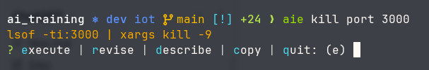

many types of tools exist:

simple chat interface
code completion in the IDE
coding agent
deep research agent
terminal ai chat
computer use agent
browser use agent
Workflow automation agent
voice agent
image generation
video generation
audio generation
STT and TTS
multi-agent systems
Scheduled/proactive agent
Event-driven agent
Physical/robotics agent

common mistakes I see
using chat interface for coding
using chat interface to get a terminal command 
using a coding agent to do research (not good enough reasearch tools (most can't access js websites out of the box and can't search deep enough, unnecessary context loss)
follow instructions to do browser actions manually instead of using a browser agent
typing instead of using a voice agent
using single agent for multi-agent tasks and vice versa
using a coding agent in a single repo instead of a monorepo
using a coding agent without the necessary skills or tools to do the job

Sometimes the right choice is not to use an AI tool at all. For example, instead of asking an ai agent everytime "what is the command to port forward this service port in kubernetes to this local port", it's actually faster and cheaper to have the ai agent create a small shell function that does this for you. demo: [fs demo.mov](fs%20demo.mov)