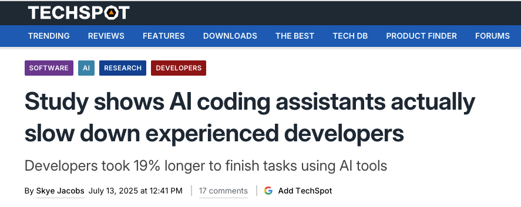
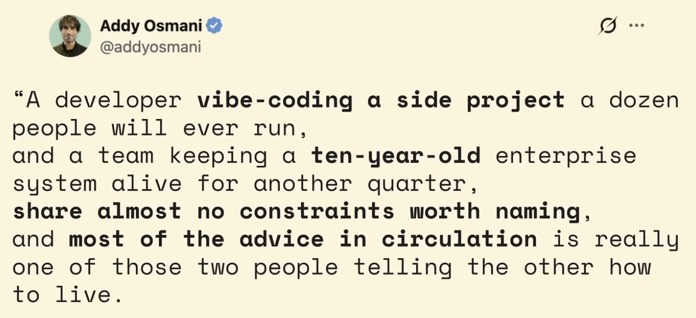
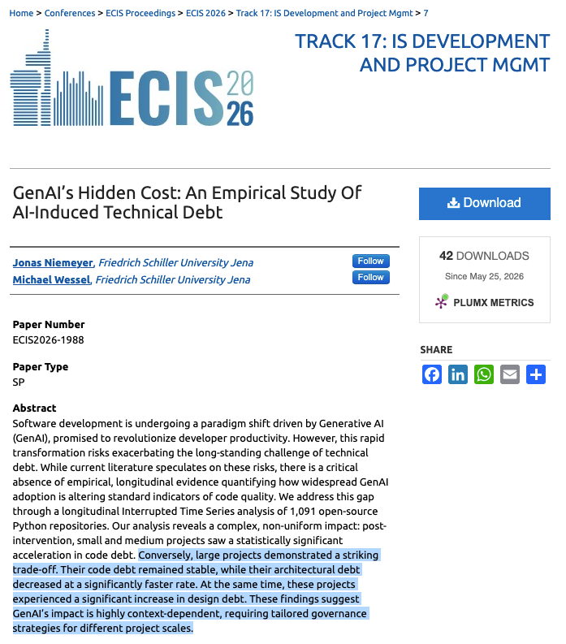

# AI-Assisted Development Workflow

A developer should have a tried and proven workflow for using AI, because simply prompting and then reviewing is not enough and can lead even to worse results and lower productivity all while costing more.

Vibe coding is not Software Engineering. Beware of the AI hype on the internet. 

Enterprise systems are:
Highly Complex

While required to be:
Efficient
Maintainable
Scalable
Reliable
Secure
Performant
Observable
Recoverable
Compliant
Testable
Auditable
Extensible
Interoperable
Data integrity

In this training I will show you example of workflows, but at the end of the day, you need to develop your own workflow that works for you and you have to keep improving it as you learn more and as the tools and models evolve.

Example workflow:

```mermaid
flowchart TD
    A([Start])

    A --> B["1. Prepare Context & Define Task"]
    B --> B1["Ensure project guidelines and context are current"]
    B1 --> B2["Define outcome, scope, constraints<br/>and acceptance criteria"]
    B2 --> B3["Provide relevant files, docs, examples,<br/>tools, skills, MCPs and permissions"]

    B3 --> C["2. Inspect, Clarify & Research"]
    C --> C1["Inspect the existing implementation"]
    C1 --> C2["Identify gaps, assumptions, risks<br/>and missing context"]
    C2 --> C3["Research unknowns using repo, docs<br/>and connected tools"]
    C3 --> C4{"Important gaps remain?"}

    C4 -- Yes --> C5["Ask targeted questions"]
    C5 --> D
    C4 -- No --> D

    D["3. Plan"]
    D --> D1["Break work into reviewable milestones"]
    D1 --> D2["Define implementation approach,<br/>tests, security and compatibility"]
    D2 --> D3["Challenge the plan:<br/>risks, edge cases, regressions,<br/>simpler alternatives"]

    D3 --> E["4. Implement Incrementally"]
    E --> E1["Make the smallest coherent change"]
    E1 --> E2["Follow project conventions"]
    E2 --> E3["Avoid unrelated changes<br/>and unnecessary dependencies"]

    E3 --> F["5. Validate"]
    F --> F1["Format / Lint"]
    F1 --> F2["Build / Type-check"]
    F2 --> F3["Unit / Integration / E2E tests"]
    F3 --> F4["Security, vulnerability<br/>and dependency checks"]

    F4 --> F5{"All checks pass?"}
    F5 -- No --> E
    F5 -- Yes --> G["6. Adversarial AI Review"]

    G --> G1["Try to find bugs, regressions,<br/>edge cases and failure paths"]
    G1 --> G2["Challenge assumptions,<br/>design and architecture"]
    G2 --> G3["Check security and unintended changes"]
    G3 --> G4{"Issues found?"}

    G4 -- Yes --> E
    G4 -- No --> H["7. Human Final Review"]

    H --> H1["Review final diff against<br/>requirements and acceptance criteria"]
    H1 --> H2["Check readability, maintainability,<br/>naming and design patterns"]
    H2 --> H3["Review new dependencies:<br/>necessity, origin, maintenance,<br/>vulnerabilities and licensing"]
    H3 --> H4{"Approved?"}

    H4 -- No --> E
    H4 -- Yes --> I["8. Finalize & Learn"]

    I --> I1["Verify desired outcome with evidence"]
    I1 --> I2["Summarize changes, checks,<br/>risks and limitations"]
    I2 --> I3["Update guidelines, docs and context<br/>when reusable knowledge was learned"]
    I3 --> I4["Turn recurring issues into<br/>tests, lint rules or automation"]

    I4 --> J([Done])
```

